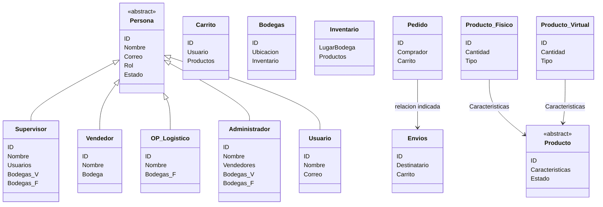
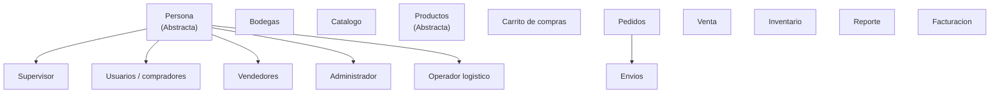

# Diagrama del sistema

Conversión del diagrama de draw.io a **Markdown + Mermaid**. Se conservan los nombres,
atributos, herencias y relaciones que aparecen explícitamente en el archivo original.
Las preguntas/comentarios del diagrama se mantienen como observaciones y no se
resuelven automáticamente. fileciteturn1file0

## Diagrama de clases

## Estructura conceptual del diagrama original

## Observaciones incluidas en el diagrama

- **Persona:** el diagrama plantea si conviene crear una clase `Persona` para
  compartir atributos entre los distintos tipos de usuarios y permitir que cada
  uno tenga sus atributos propios.
- **Métodos de pago:** se pregunta si debería existir una clase separada para
  manejar los métodos de pago.
- **Pedidos y envíos:** se plantea si los pedidos y los envíos podrían
  simplificarse en una misma clase.
- **Productos:** `Producto` aparece como clase abstracta y se distinguen
  `Producto fisico` y `Producto virtual`.

## Clases y atributos presentes

| Clase                  | Atributos                                              |
| ---------------------- | ------------------------------------------------------ |
| `Persona` (abstracta)  | `ID`, `Nombre`, `Correo`, `Rol`, `Estado`              |
| `Usuario`              | `ID`, `Nombre`, `Correo`                               |
| `Vendedor`             | `ID`, `Nombre`, `Bodega`                               |
| `OP logistico`         | `ID`, `Nombre`, `Bodegas F`                            |
| `Administrador`        | `ID`, `Nombre`, `Vendedores`, `Bodegas V`, `Bodegas F` |
| `Supervisor`           | `ID`, `Nombre`, `Usuarios`, `Bodegas V`, `Bodegas F`   |
| `Carrito`              | `ID`, `Usuario`, `Productos`                           |
| `Bodegas`              | `ID`, `Ubicacion`, `Inventario`                        |
| `Inventario`           | `LugarBodega`, `Productos`                             |
| `Producto` (abstracta) | `ID`, `Caracteristicas`, `Estado`                      |
| `Pedido`               | `ID`, `Comprador`, `Carrito`                           |
| `Envios`               | `ID`, `Destinatario`, `Carrito`                        |
| `Producto fisico`      | `ID`, `Cantidad`, `Tipo`                               |
| `Producto virtual`     | `ID`, `Cantidad`, `Tipo`                               |

## Elementos conceptuales adicionales

El diagrama también contiene los elementos `Catalogo`, `Venta`, `Reporte`,
`Inventario`, `Facturacion`, `Bodegas`, `Carrito de compras` y
`Productos (Abstracta)` como parte de la visión general del sistema.
